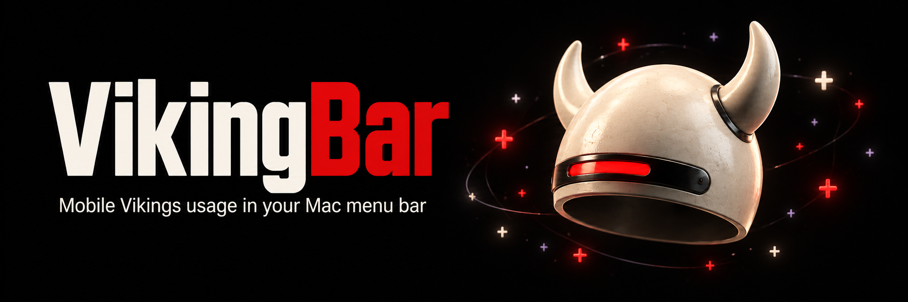

# VikingBar

VikingBar is a native macOS menu bar app for Mobile Vikings. It shows your remaining mobile data without opening My Viking.

## What it shows

The helmet in the menu bar shows the selected data bundle's remaining allowance. The app includes:

- Separate SIM and data bundle selection, with allowance, expiry, and extra charges in euros.
- An optional remaining-GB label beside the helmet, controlled in **Settings**.
- Customer-wide Viking Points, with separate available, pending, and blocked balances and recent transactions.
- Manual refresh and stale-data indicators that keep the last successful balance visible when a request fails.

Each SIM keeps its own allowance. Viking Points belong to the whole account. Missing amounts stay unavailable rather than appearing as zero.

Install a local build with `make install-app`. Settings also save the card's used/remaining display and refresh interval. Launch-at-login controls report the actual macOS registration state. See [local installation, updates, and removal](docs/local-install.md). Installed native proof is tracked separately in the [verification map](.agents/skills/verify-vikingbar/features/installed-app.md).

The **Bills** tab shows the latest account invoice or credit note, including grouped scope, payment state, and amount due. **Open PDF** explicitly downloads and opens that document. See [invoice handling and proof](docs/invoices.md).

## Requirements and availability

VikingBar currently targets Apple Silicon Macs with macOS 14 or later. Building from source requires Swift 6.2 or later and Python 3.

Development builds have no Developer ID signing or notarization. Public distribution and automatic updates are not configured. The [build download guide](docs/RELEASING.md#download-a-development-build) covers app and CLI artifacts from GitHub Actions.

Daily usage history and cycle forecasts remain planned. The [issue tracker](https://github.com/BramVR/VikingBar/issues) contains feature work and acceptance criteria.

## Getting started

The [development guide](docs/development.md) covers source builds and a demo with synthetic data. `make package-app` creates `.build/app/VikingBar.app`. A launch with `--fixture finite` shows a sample allowance without account or Keychain access.

The app has no Dock icon. Its helmet opens the data card. **Settings** contains **Show remaining GB in menu bar**, which defaults to off. That label uses decimal GB even when the card uses GiB.

The [website](https://bramvr.github.io/VikingBar/) explains setup and includes an interactive sample menu. See the [website development guide](website/README.md) for its separate build and checks.

For your own balance, the [account setup guide](docs/live-account.md) covers default direct sign-in and optional **Connect with 1Password**. Direct sign-in needs approved public-client details and your account credentials. The optional 1Password helper requires the 1Password CLI, tmux, `/usr/bin/python3`, and the service-account and credential-reference setup described in that guide.

Opening the app without `--fixture` restores a live session or shows account setup. Subsequent refreshes use the stored token.

## Credentials and account data

Direct sign-in passes credentials to the bundled CLI over stdin. The optional connection helper reads the configured 1Password item once. The bundled CLI stores refresh tokens in macOS Keychain and communicates with the app over private pipes. The public OAuth client needs no client secret.

VikingBar restricts account requests to authentication and allowlisted data reads. Account changes and payments are outside its scope. Credentials, account responses, and private screenshots stay out of commits and hosted CI. The [live proof guide](docs/live-proof.md) documents request limits and verification coverage.

## Development and help

VikingBar uses SwiftPM, SwiftUI, AppKit, a shared Swift core, and a diagnostic CLI. `make check` runs formatting, lint, compilation, tests, documentation checks, and CLI fixtures. The [development guide](docs/development.md) lists the required tools.

Project resources:

- [Contribution guide](CONTRIBUTING.md) for checks and pull request requirements.
- [Documentation index](docs/README.md) for architecture, account setup, and verification.
- [Changelog](CHANGELOG.md) for implemented changes.
- [GitHub issues](https://github.com/BramVR/VikingBar/issues) for bug reports and feature requests.

Maintained by [BramVR](https://github.com/BramVR).

## License and attribution

VikingBar's own code license has not yet been selected. [CodexBar](https://github.com/steipete/CodexBar) is the reference for app structure and contributor guidance. Copied CodexBar code retains its MIT attribution.
